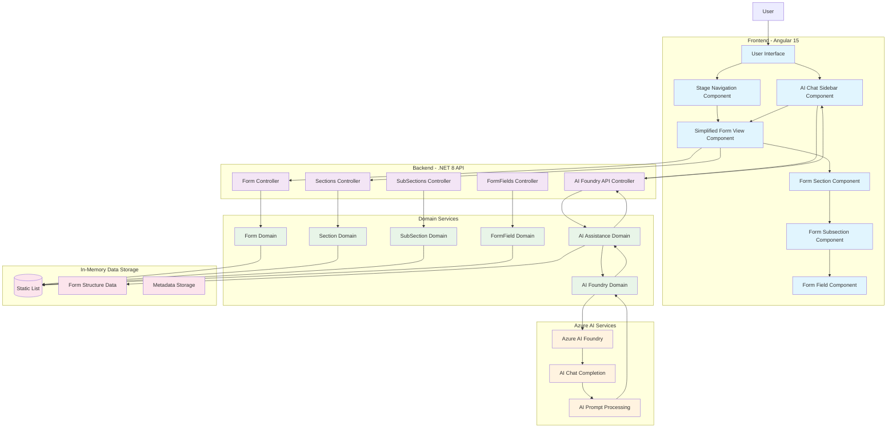
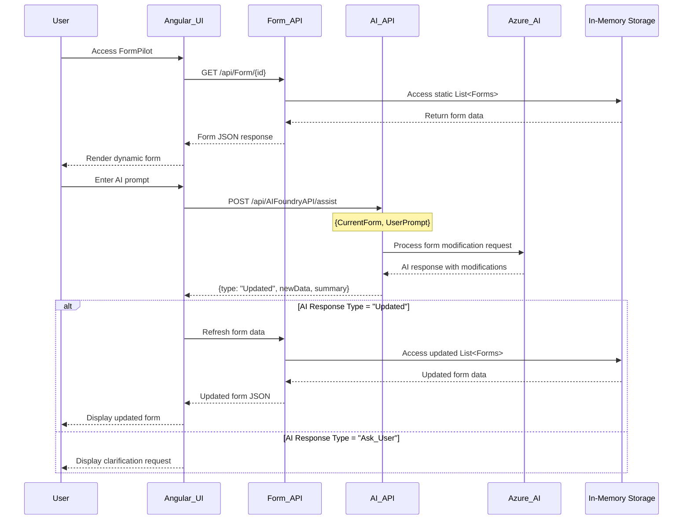
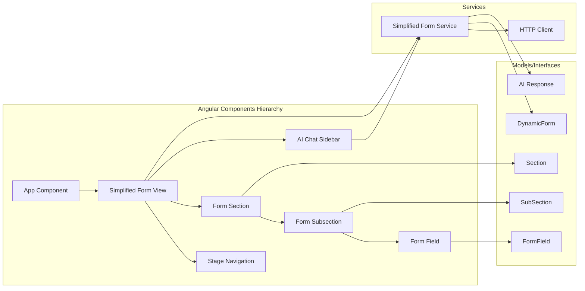
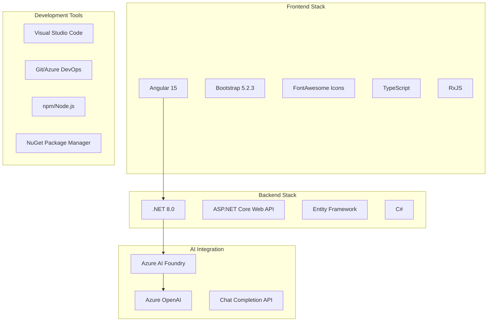
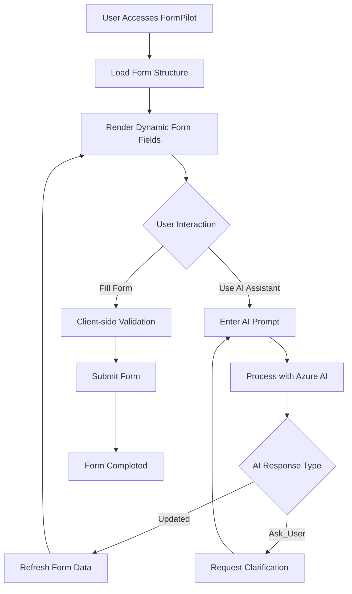
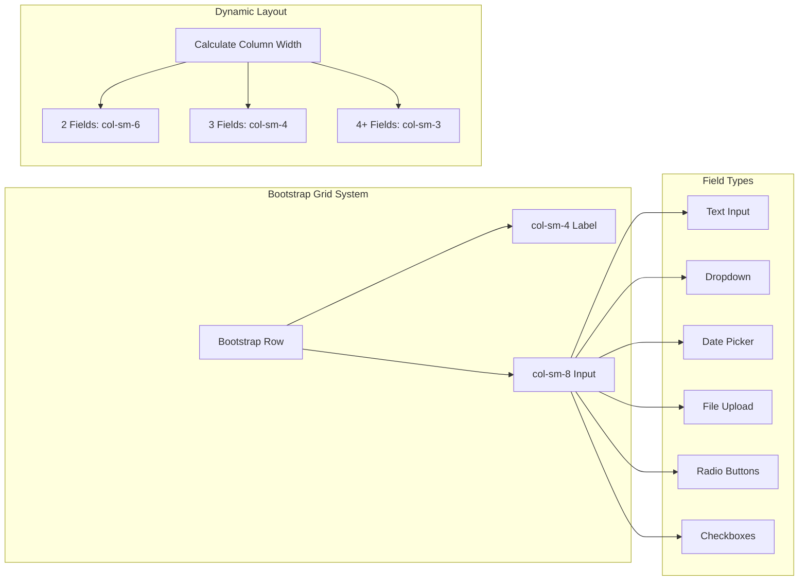

# FormPilot POC - Technical Flow Chart

## System Architecture Overview

```mermaid
graph TB
    %% User Interface Layer
    subgraph "Frontend - Angular 15"
        UI[User Interface]
        SN[Stage Navigation Component]
        FS[Form Section Component]
        FSS[Form Subsection Component]
        FF[Form Field Component]
        AIC[AI Chat Sidebar Component]
        SFV[Simplified Form View Component]
    end

    %% API Layer
    subgraph "Backend - .NET 8 API"
        FC[Form Controller]
        SC[Sections Controller]
        SSC[SubSections Controller]
        FFC[FormFields Controller]
        AFAC[AI Foundry API Controller]
    end

    %% Domain Layer
    subgraph "Domain Services"
        FD[Form Domain]
        SD[Section Domain]
        SSD[SubSection Domain]
        FFD[FormField Domain]
        AAD[AI Assistance Domain]
        AFD[AI Foundry Domain]
    end

    %% External Services
    subgraph "Azure AI Services"
        AAI[Azure AI Foundry]
        ACR[AI Chat Completion]
        APR[AI Prompt Processing]
    end

    %% Data Layer
    subgraph "In-Memory Data Storage"
        MEMORY[(Static List<Forms>)]
        FS_DATA[Form Structure Data]
        META[Metadata Storage]
    end

    %% User Interactions
    USER[User] --> UI
    UI --> SN
    UI --> AIC
    SN --> SFV
    SFV --> FS
    FS --> FSS
    FSS --> FF

    %% API Calls
    SFV --> FC
    SFV --> SC
    AIC --> AFAC
    
    %% Controller to Domain
    FC --> FD
    SC --> SD
    SSC --> SSD
    FFC --> FFD
    AFAC --> AAD

    %% AI Integration
    AAD --> AFD
    AFD --> AAI
    AAI --> ACR
    ACR --> APR

    %% Data Access
    FD --> MEMORY
    SD --> MEMORY
    SSD --> MEMORY
    FFD --> MEMORY
    AAD --> FS_DATA
    
    %% Response Flow
    APR --> AFD
    AFD --> AAD
    AAD --> AFAC
    AFAC --> AIC
    AIC --> SFV

    %% Styling
    classDef frontend fill:#e1f5fe
    classDef backend fill:#f3e5f5
    classDef domain fill:#e8f5e8
    classDef ai fill:#fff3e0
    classDef data fill:#fce4ec

    class UI,SN,FS,FSS,FF,AIC,SFV frontend
    class FC,SC,SSC,FFC,AFAC backend
    class FD,SD,SSD,FFD,AAD,AFD domain
    class AAI,ACR,APR ai
    class MEMORY,FS_DATA,META data
```

## Data Flow Diagram

```mermaid
sequenceDiagram
    participant User
    participant Angular_UI
    participant Form_API
    participant AI_API
    participant Azure_AI
    participant InMemory as In-Memory Storage

    %% Form Loading Flow
    User->>Angular_UI: Access FormPilot
    Angular_UI->>Form_API: GET /api/Form/{id}
    Form_API->>InMemory: Access static List<Forms>
    InMemory-->>Form_API: Return form data
    Form_API-->>Angular_UI: Form JSON response
    Angular_UI-->>User: Render dynamic form

    %% AI Assistance Flow
    User->>Angular_UI: Enter AI prompt
    Angular_UI->>AI_API: POST /api/AIFoundryAPI/assist
    Note over AI_API: {CurrentForm, UserPrompt}
    AI_API->>Azure_AI: Process form modification request
    Azure_AI-->>AI_API: AI response with modifications
    AI_API-->>Angular_UI: {type: "Updated", newData, summary}
    
    %% Form Update Flow
    alt AI Response Type = "Updated"
        Angular_UI->>Form_API: Refresh form data
        Form_API->>InMemory: Access updated List<Forms>
        InMemory-->>Form_API: Updated form data
        Form_API-->>Angular_UI: Updated form JSON
        Angular_UI-->>User: Display updated form
    else AI Response Type = "Ask_User"
        Angular_UI-->>User: Display clarification request
    end
```

## Component Architecture

```mermaid
graph LR
    subgraph "Angular Components Hierarchy"
        APP[App Component]
        APP --> SFV[Simplified Form View]
        SFV --> SN[Stage Navigation]
        SFV --> FS[Form Section]
        SFV --> AIC[AI Chat Sidebar]
        FS --> FSS[Form Subsection]
        FSS --> FF[Form Field]
    end

    subgraph "Services"
        SFS[Simplified Form Service]
        HTTP[HTTP Client]
    end

    subgraph "Models/Interfaces"
        DF[DynamicForm]
        SEC[Section]
        SUB[SubSection]
        FIELD[FormField]
        AIR[AI Response]
    end

    SFV --> SFS
    AIC --> SFS
    SFS --> HTTP
    SFS --> DF
    SFS --> AIR
    FS --> SEC
    FSS --> SUB
    FF --> FIELD
```

## Technology Stack

```mermaid
graph TB
    subgraph "Frontend Stack"
        A[Angular 15]
        B[Bootstrap 5.2.3]
        C[FontAwesome Icons]
        D[TypeScript]
        E[RxJS]
    end

    subgraph "Backend Stack"
        F[.NET 8.0]
        G[ASP.NET Core Web API]
        H[Entity Framework]
        I[C#]
    end

    subgraph "AI Integration"
        J[Azure AI Foundry]
        K[Azure OpenAI]
        L[Chat Completion API]
    end

    subgraph "Development Tools"
        M[Visual Studio Code]
        N[Git/Azure DevOps]
        O[npm/Node.js]
        P[NuGet Package Manager]
    end

    A --> F
    F --> J
    J --> K
```

## Key Features Flow

```mermaid
graph TD
    START[User Accesses FormPilot] --> LOAD[Load Form Structure]
    LOAD --> RENDER[Render Dynamic Form Fields]
    RENDER --> INTERACT{User Interaction}
    
    INTERACT -->|Fill Form| VALIDATE[Client-side Validation]
    INTERACT -->|Use AI Assistant| AI_PROMPT[Enter AI Prompt]
    
    AI_PROMPT --> AI_PROCESS[Process with Azure AI]
    AI_PROCESS --> AI_RESPONSE{AI Response Type}
    
    AI_RESPONSE -->|Updated| REFRESH[Refresh Form Data]
    AI_RESPONSE -->|Ask_User| CLARIFY[Request Clarification]
    
    REFRESH --> RENDER
    CLARIFY --> AI_PROMPT
    VALIDATE --> SUBMIT[Submit Form]
    SUBMIT --> END[Form Completed]
```

## Responsive Grid Layout

```mermaid
graph LR
    subgraph "Bootstrap Grid System"
        ROW[Bootstrap Row]
        ROW --> COL1[col-sm-4 Label]
        ROW --> COL2[col-sm-8 Input]
    end

    subgraph "Field Types"
        TEXT[Text Input]
        DROP[Dropdown]
        DATE[Date Picker]
        FILE[File Upload]
        RADIO[Radio Buttons]
        CHECK[Checkboxes]
    end

    subgraph "Dynamic Layout"
        CALC[Calculate Column Width]
        CALC --> TWO[2 Fields: col-sm-6]
        CALC --> THREE[3 Fields: col-sm-4]
        CALC --> FOUR[4+ Fields: col-sm-3]
    end

    COL2 --> TEXT
    COL2 --> DROP
    COL2 --> DATE
    COL2 --> FILE
    COL2 --> RADIO
    COL2 --> CHECK
```
